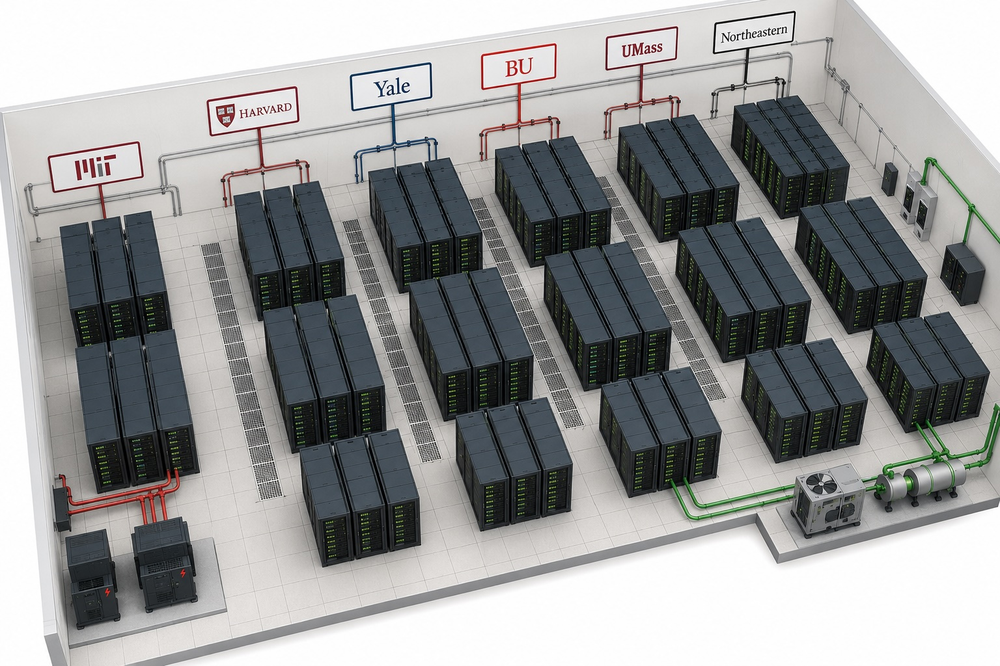

# Research Computing Training
---


## Presenter
---
Khurshid Shaymardanov \
HPC Systems Engineer \
Research Computing (RC) \
https://rc.northeastern.edu/research-computing-team/

# Explorer Cluster for Instructors and Courses
**HPC Summer Training Series**


---


# Explorer HPC Cluster

The Explorer cluster is one of several clusters housed at the MGHPCC (Holyoke, MA). https://www.mghpcc.org/​
Explorer cluster has 1,024 CPU nodes, 50,000 CPU cores, and over 200 GPUs.​
Performant and archival storage capabilities. ​

**Architecture layers in the cluster view:**
- ⚙️ Layer 1 — Workload & Job Management (sbatch, srun, OOD - https://ood.explorer.northeastern.edu, sacct)
- 📦 Layer 2 — Software Environment (module avail, OOD)
- 🔐 Layer 3 — Identity & Resource Access (partitions, QOS, sacctmgr, sshare)
- 🖥️ Compute Nodes — node grid with drilldown
    - Compute: courses and courses-gpu partitions
    - All members of the course can also access the standard explorer partitions (express, short, gpu). https://rc.northeastern.edu/partitions/

---


## Explorer Cluster — Node Specifications


**Cluster:** `explorer` &nbsp;·&nbsp; production &nbsp;·&nbsp; InfiniBand HDR 100G  
**OS:** Rocky Linux 8.9 &nbsp;·&nbsp; **Scheduler:** Slurm 23.11.4  
**Utilization:** 71%

### CPU Nodes — `courses` partition

```bash
[k.shaymardanov@explorer-02 courses-for-instructors]$ sinfo -p courses -N -o "%.12N %.8c %.8m %.30G %.8t"
```
```text
    NODELIST     CPUS   MEMORY                           GRES    STATE
       c0584       28   256000                         (null)     idle
       c0598       28   257000                         (null)    down*
       c0601       28   257000                         (null)    down*
       c0617       28   257000                         (null)     idle
       c0638       28   257000                         (null)     idle
       c0642       28   256000                         (null)     idle
       c0648       28   256000                         (null)     idle
       c0655       28   256000                         (null)     idle
       c0662       28   257000                         (null)     idle
       c0666       28   257000                         (null)     idle
       c3014       20    62000                         (null)      mix
       c3039       20   128000                         (null)    down*
       d0010       56   186000                         (null)     idle
       d0011       56   186000                         (null)     idle
       d0016       56   186000                         (null)    down*
       d0017       56   186000                         (null)     idle
       d0018       56   186000                         (null)     idle
       d0036       56   186000                         (null)      mix
       d0125      112   191319                         (null)     idle
       d0135      128   514000                         (null)     idle
       d0144      128   515000                         (null)    down*`
```

### GPU Nodes — `courses-gpu` partition

```bash
[k.shaymardanov@explorer-02 courses-for-instructors]$ sinfo -p courses-gpu -N -o "%.12N %.8c %.8m %.30G %.8t"
```
```text
NODELIST     CPUS   MEMORY                           GRES    STATE
       c2184       28   512000              gpu:p100:3(S:0-1)    down*
       c2185       28   512000              gpu:p100:4(S:0-1)     idle
       c2186       28   512000              gpu:p100:4(S:0-1)     idle
       c2187       28   512000              gpu:p100:4(S:0-1)    down*
       c2188       28   512000              gpu:p100:3(S:0-1)     idle
       c2189       28   515000                         (null)     idle
       c2190       28   515000                         (null)     idle
       c2191       28   515000                         (null)     idle
       c2192       28   515000                         (null)     idle
       c2193       28   512000              gpu:p100:4(S:0-1)     idle
       c2194       28   512000              gpu:p100:4(S:0-1)     idle
       c2195       28   512000              gpu:p100:4(S:0-1)     idle
       d1004       28   187000         gpu:v100-sxm2:4(S:0-1)      mix
       d1011       28   191000         gpu:v100-sxm2:4(S:0-1)    drain
```

### GPU Type Summary

```bash
[k.shaymardanov@explorer-02 courses-for-instructors]$ sinfo -p courses-gpu -eO "NodeList:22,CPUs:6,Memory:8,Gres:35,NodeAIOT:12,StateLong:10"      
```
```text
NODELIST              CPUS  MEMORY  GRES                               NODES(A/I/O/STATE     
c2184                 28    512000  gpu:p100:3(S:0-1)                  0/0/1/1     down*     
c2187                 28    512000  gpu:p100:4(S:0-1)                  0/0/1/1     down*     
d1011                 28    191000  gpu:v100-sxm2:4(S:0-1)             0/0/1/1     drained   
d1004                 28    187000  gpu:v100-sxm2:4(S:0-1)             1/0/0/1     mixed     
c[2185-2186,2193-2195]28    512000  gpu:p100:4(S:0-1)                  0/5/0/5     idle      
c2188                 28    512000  gpu:p100:3(S:0-1)                  0/1/0/1     idle      
c[2189-2192]          28    515000  (null)                             0/4/0/4     idle   
```


---


## Partitions


| Partition | Nodes | Total CPUs | GPU Types | Time Limit | Mem default / max | State | Notes |
|-----------|-------|-----------|-----------|------------|-------------------|-------|-------|
| `courses` | 21 | 1,024 | — | 2-00:00:00 | 4G / 256G | up | General CPU compute for coursework |
| `courses-gpu` | 14 | 960 | NVIDIA Tesla V100-SXM2-32GB<br>NVIDIA Tesla P100-PCIE-12GB | 1-00:00:00 | 8G / 768G | up | GPU compute — multiple GPU types available (see node list) |


---


## Software Environment


*27 catalogue entries &nbsp;·&nbsp; 23 in `module avail` &nbsp;·&nbsp; 10 in Open OnDemand*

#### `module avail` — CLI software catalogue

```
bash
[k.shaymardanov@explorer-02 courses-for-instructors]$ module avail
```
```
text
---------------------------------------------------------- /shared/EL9/explorer/modulefiles -----------------------------------------------------------
7zip/2501          code-server/4.91.1   FFmpeg/7.1.1                 intel/tbb-2022.0    namd/2.14-mpi-plumed  perl/5.40.0           VMD/1.9.3     
Abaqus/2023        code-server/4.101.1  GA/5.9.2                     intel/umf-0.9.1     namd/3.0.1            plumed/2.10.0         VMD/1.9.4a55  
Abaqus/2024        code-server/4.108.2  GA/5.9.2-intel               job-assist/1.0      namd/3.0.1-CUDA       python/3.13.5         VTune/2025.0  
admin/2018-10-10   code-server/4.109.0  gaussian/g16                 jq/1.7.1            netcdf/4.9.3-gcc      qhull/8.1             weka/3.8.6    
AMBER/24           code-server/4.109.5  git/2.52.0                   julia/1.10.4        netcdf/4.9.3-intel    R/4.4.1               
AMBER/24-netcdf    comsol-jornet/60     glew/2.2.0                   knime/5.3.1         netlogo/6.4.0         rclone/1.72.0         
anaconda3/2024.06  comsol-nanofem/62    GNU-parallel/2025-04-22      LAMMPS/29Aug2024    nextflow/24.10.3      ROCm/6.3.0            
Ansys/2025R1       comsol-west/60       go/1.23.2                    lsb/1.0             nextflow/25.04.6      samtools/1.21         
bamtools/2.5.2     cplex/20.1           gromacs/2024.3               Lumerical/2025R1    nodejs/v22.11.0       SAS/9.4               
bbmap/39.11        cuda/12.1.1          gromacs/2024.3-cpu           mathematica/14.1.0  Nsight/2024.7.1       schrodinger/2024-4    
bcftools/1.21      cuda/12.3.0          gurobi/11.0.3                matlab/3.0.1        nvidia-hpc-sdk/24.7   schrodinger/2025-3    
bedtools/2.31.1    cuda/12.3.0.old      gurobi/12.0.2                matlab/R2023b       OpenBabel/2.4.1       spark/4.1.0           
blast/2.13.0       cuda/12.8.0          HDF5/1.14.6                  matlab/R2024b       OpenBLAS/0.3.29       sratoolkit/12Dec2024  
Boost/1.88.0       cuda/13.2.0          HDF5/nvhpc-1.14.6            matlab/R2025a       OpenCV/4.10.0         star/2.7.11b          
bowtie2/2.5.4      cuDNN/9.10.2         htop/3.3.0                   matlab/R2025b       OpenFOAM/12           starccm+/18.02.008    
bwa/0.7.18         cursor-server/1.5.9  igv/2.18.4                   miniconda3/24.11.1  OpenJDK/22.0.2        starccm+/18.04.009    
clustal/2.1        discovery/1.0        intel/compilers-2025.0.4     miniconda3/25.9.1   OpenMPI/4.1.6         Stata/17              
cmake/3.30.2       EMAN2/2.99.47        intel/compilers-rt-2025.0.4  Molcas/25.06        OpenSees/3.7.1        Tinker/8.11.3         
cmake/4.2.3        explorer/1.0         intel/mkl-2025.0             MPICH/4.3.0b1       ParaView/5.13.0-RC2   trimmomatic/0.39      
cmake/4.4.0        fastqc/0.12.1        intel/mpi-2021.14            namd/2.14-mpi       ParaView/5.13.1       vcftools/0.1.16       

----------------------------------------------------------- /usr/share/Modules/modulefiles ------------------------------------------------------------
dot  module-git  module-info  modules  null  use.own  

Key:
loaded  modulepath
```

#### Open OnDemand — interactive browser apps

| App | Version | Category | Description |
|-----|---------|----------|-------------|
| 🐍 **Python** | `3.12.0` | lang | Python interpreter |
| 📊 **R** | `4.3.2` | lang | Statistical computing |
| ◍ **Julia** | `1.10.0` | lang | High-performance scientific |
| 🤖 **TensorFlow** | `2.16.1` | ml | ML framework by Google |
| 🤖 **PyTorch** | `2.3.0` | ml | ML framework by Meta |
| 📈 **ParaView** | `5.12` | viz | Parallel visualisation |
| 📐 **MATLAB** | `R2024a` | math | Numerical computing |
| 🎓 **Jupyter** | `4.2.0` | lang | Interactive notebooks |
| 📊 **RStudio** | `2024.04` | lang | RStudio Server |
| 💻 **VSCode** | `1.89` | viz | VS Code Server |


---


<div style="border:2px dashed #c8c7c0;border-radius:8px;padding:20px;text-align:center;color:#9b9a94;background:#f7f7f5;margin:8px 0">🖼️ <em>alt text</em><br><code style="font-size:11px"images/>glossary_data-center-architecture-diagram.png.webp</code></div>


---


# Partner universities in MGHPCC




---


# Resources availalbe at RC
<a href="data:images/glossary_data-center-architecture-diagram.png;base64,..." target="_blank"
   title="Click to open full size">
  
</a>


---


# Classroom resources 
https://rc-docs.northeastern.edu/en/explorer-main/classroom/
<div style="border:2px dashed #c8c7c0;border-radius:8px;padding:20px;text-align:center;color:#9b9a94;background:#f7f7f5;margin:8px 0">🖼️ <em>pic</em><br><code style="font-size:11px">classroom-resources.jpeg</code></div>


---


# Courses
## How to request access to the Explorer cluster for a course?​

- Once the course is present in Canvas, you can fill out a classroom access form: https://bit.ly/NURC-Classroom​

- We require all courses to have be in canvas to be added to the cluster.​

<div style="border:2px dashed #c8c7c0;border-radius:8px;padding:20px;text-align:center;color:#9b9a94;background:#f7f7f5;margin:8px 0">🖼️ <em>craf</em><br><code style="font-size:11px">classroom-access-form-1.jpeg</code></div>
<div style="border:2px dashed #c8c7c0;border-radius:8px;padding:20px;text-align:center;color:#9b9a94;background:#f7f7f5;margin:8px 0">🖼️ <em>craf</em><br><code style="font-size:11px">classroom-access-form-2.jpeg</code></div>


---


# Storage
- Storage: each course has 1 TB in /courses
  - All students, instructors, teaching assistants, auditors also get username specific `/home` and `/scratch` space.
  - The `data/` and `shared/` directories have read-execute permissions for students, and read-write-execute for staff (Instructors and TA’s).
<div style="border:2px dashed #c8c7c0;border-radius:8px;padding:20px;text-align:center;color:#9b9a94;background:#f7f7f5;margin:8px 0">🖼️ <em>data-shared</em><br><code style="font-size:11px">data,shared.jpeg</code></div>

  - The `staff/` and `students/` directories have username specific sub-directories that are read-write-execute only by the owner. ​
<div style="border:2px dashed #c8c7c0;border-radius:8px;padding:20px;text-align:center;color:#9b9a94;background:#f7f7f5;margin:8px 0">🖼️ <em>staff-students</em><br><code style="font-size:11px">staff,students.jpeg</code></div>

  - It is the responsibility of the instructor to maintain data or materials for their course.​
    - We recommend storing the data in `/projects` in between terms. (https://bit.ly/NURC-NewStorage)​
  - Course material is archived for one year and then deleted.


---


# Courses Partitions


| Part. Name  |Time limit (default/max)|Running jobs(user/course)|Sub. jobs(user/course)|Core limit (per user)|  Use case                                              |  
|-------------|------------------------|-------------------------|----------------------|---------------------|--------------------------------------------------------|
|  courses    |  `4/24 Hours`          | `25/250`                |  `50/100`            |  `128`              |`Best for serial or small parallel jobs (--nodes=2 max)`| 
|             |                        |                         |                      |                     |`that need to run for up to 24 hours.`                  |
|-------------|------------------------|-------------------------|----------------------|---------------------|--------------------------------------------------------|
| courses-gpu |  `4/24 Hours`          | `1/100`                 |  `50/100`            |  `1 GPU`            |`For jobs that require GPUs and can run on a single GPU`|
|-------------|------------------------|-------------------------|----------------------|---------------------|--------------------------------------------------------|


- These partitions are only available for students and instructors.
- You can specify the courses partition when you launch a job via the OOD or on the command line


---


## Cluster Access


# Using the terminal (srun and sbatch demo)
- Mac: terminal
- Windows: MobaXterm or Putty on port 22

## Accessing CLI (command line interface) from OOD
Go to OOD homepage then to “Clusters” tab and select “>_explorer Shell Access” (you may be prompted to login)


**SSH access:**


```bash
ssh username@login.explorer.northeastern.edu

# With -X11 forwarding and passwordless ssh:
ssh –Y username@login.explorer.northeastern.edu
```


---


## Batch script description


```bash
#!/bin/bash                   # Shebang – path to Bash interpreter that runs lines in file. 

                              #   SBATCH directives –
#SBATCH --partition=courses   # - Partition name where job needs to run.
#SBATCH --job-name=test       # - The name of the job 
#SBATCH --time=01:00:00       # - Allocated time for the compute resources
#SBATCH –-nodes=1             # - Nodes being allocated
#SBATCH –-ntasks=10           # - Total number of parallel tasks to launch for a job or step
#SBATCH –-cpus-per-task=2     # - Number of CPUs requested
#SBATCH --output=%j.output    # - Output log file
#SBATCH --error=%j.error      # - Error log file


echo "HELLO WORLD!”           # Instruction – Bash command to execute when job runs
```


- Jobs should be submitted from login terminal using:
    - `sbatch sample.sh`
- You should see the following output:
    - `Submitted batch job slurm_jobid`
- When the job finishes, you should have:
    - `JOBID.output & JOBID.error`
- If the job completed successfully:
    - `<jobid>.error` should be empty, & 
    - `<jobid>.output` should contain the output "Hello World".


---


## Interactive (srun) or batch (sbatch) job?
The module `job-assist` provides an interactive tool to write srun commands or generate sbatch scripts, 
https://rc-docs.northeastern.edu/en/explorer-main/runningjobs/runningsjob.html.

### When to use which
- Interactive: `srun`
    - Great for running classroom demonstrations, installing software via conda environments, running simple tests, developing code, etc. 
- Non-interactive: `sbatch`
    - Great for longer jobs, or when running many jobs, that don’t need to be monitored interactively (the code works).

### What CPU resources are available currently
- To see nodes' statuses specifically within the `courses` partition:
    - `sinfo -p courses --long`
- The ones which are idle:
    - `sinfo -p courses -t idle`
- Specs of the node of interest:
    - `scontrol show node <nodename>`
 
### What GPU resources are available currently
- To see nodes' statuses specifically within the `courses-gpu` partition:
    - `sinfo -o "%N %G %t" -p courses-gpu`
- Specs and allocated resources for the GPU node:
    - `scontrol show node <node_name> | grep -i gres`
- GPU usage accros course-gpu partition:
    - `squeue -p courses-gpu -o "%N %b %C"`

## Monitoring jobs
- To see JOB ID:
    - `squeue –u username`
    - `squeue –u k.shaymardanov`
- To see more information about your jobs:
    - `scontrol show job slurm_jobid`
- To cancel a job:
    - `scancel slurm_jobid`
- To see job resource usage efficiency:
    - `seff slurm_jobid`


```
bash
[k.shaymardanov@explorer-02 ~]$ module load job-assist/1.0 
```
```
text
[k.shaymardanov@explorer-02 ~]$ job-assist
SLURM Menu:
1. Default mode (srun --pty /bin/bash)
2. Interactive Mode
3. Batch Mode
4. Exit
Enter your option:
```


---


# Open On-Demand (OOD) demo


---


# RC Support
## - Office Hours; 
## - Consultations, and;
## - Service now tickets
Details:
- https://rc-docs.northeastern.edu/en/explorer-main/index.html
- https://rc.northeastern.edu/support/gettinghelp/
- rchelp@northeastern.edu
